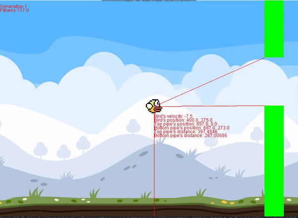

# Genetic Flappy Bird

Neural network learns to play Flappy Bird. The algorithm is simple:
- Initialize a population of 15 birds. Each bird has a random brain with random parameters. A brain would look like following

# References
- [Thanks to @john525 for flappy bird starter code. I am not a good game developer :)](https://github.com/john525/Flappy-Bird-Clone)
- [Thanks to @Code-Bullet for the inspiration](https://www.youtube.com/watch?v=WSW-5m8lRMs&t=376s)